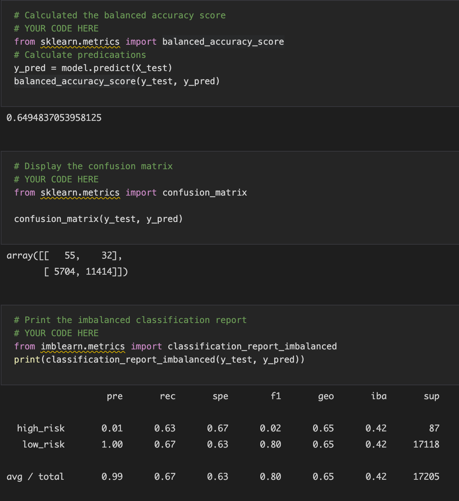
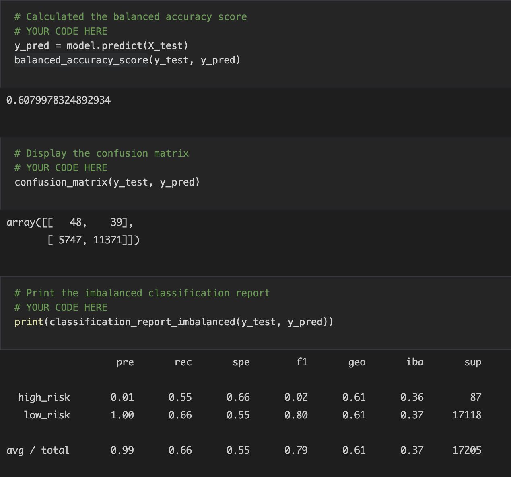
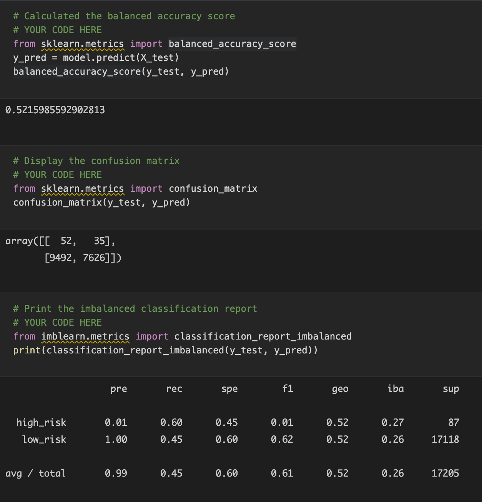
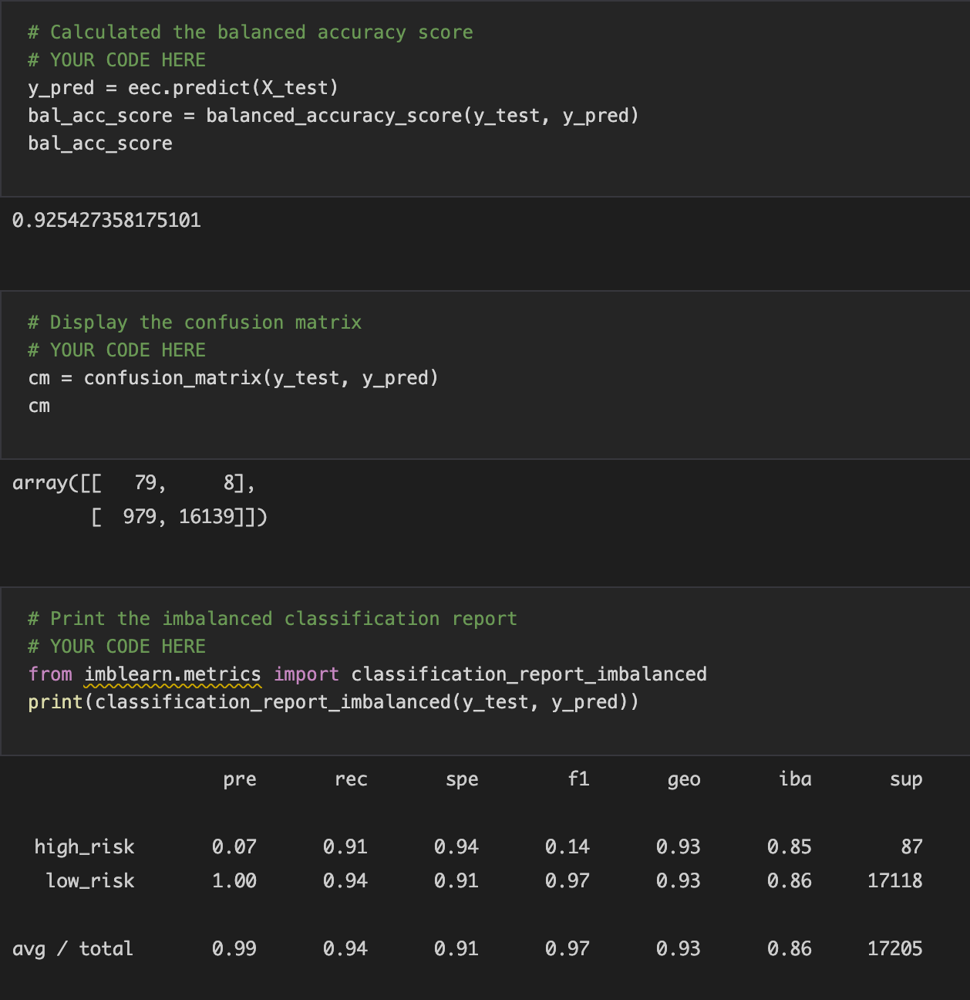

# Credit_Risk_Analysis

## Overview of Analysis

For this analysis, I need to solve a credit card risk challenge using machine learning. Since credit risk is an unbalanced classification problem, I need to employ different techniques to train and evaluate models with unblanaced classes. I will use the imbalanced-learn and scikit-learn libraries to build models using resampling. Then, I will oversample the data using RandomOverSampler and SMOTE, and undersample the data using ClusterCentroids. I will then combine the over and undersampling methods using SMOTEENN. Lastly, I will compare two machine learning models, BalancedRandomForestClassifies and Easy EnsembleClassifier, to predict credit risk. 

### Purpose

The purpose of this analysis is to determine whether these machine learning models should be used to predict credit risk.

## Results

### RandomOverSampler Model

* The balanced accuracy score is about 65%.

* The high_risk precision is 1% and its recall score is 62%.

* The low_risk precision score is 100% with a recall of 68%. The precision score is very high because the low_risk population is high.

### SMOTE Model

* The balanced accuracy score is 61%.

* The high_risk precision is 1% and the recall is 55%.

* The low_risk precision is 100% and the recall is 67%. The low_risk population is high, so the precision score is high.

### ClusterCentroids Model

* The balanced accuracy score is 52%.

* The high_risk precision is 1% and the recall is 60%.

* The low_risk precision is 100% and the recall is 45%. The recall is only 45% because of a high number of false positives.

### SMOTEENN Model

* The balanced accuracy score is 65%.

* The high_risk precision is 1% and the recall is 75%.

* The low_risk precision is 100% and the recall is 56%. The recall is only 56% because of a high number of false positives.

### BalancedRandomForestClassifier Model

* The balanced accuracy score is 79%.

* The high_risk precision is 4% and the recall is 67%.

* The low_risk precision is 100% and the recall is 91%. The recall is 91% because of a low number of false positives.

### EasyEnsembleClassifier Model

* The balanced accuracy score is 93%.

* The high_risk precision is 7% and the recall is 91%.

* The low_risk precision is 100% and the recall is 94%. The recall is 94% because of a low number of false positives.

## Summary

I ran six different tests to determine balanced accuracy, precision, and recall. None of the tests showed high precision in determining if a credit risk is high or not. The high_risk precision didn't get above 7%, which is very low. The best model we used was the EasyEnsembleClassifier model because it has a recall of 91% for high_risk, but the precision was still low at 7%. Since the precision is low, a lot of low_risk credits are falsely detected as high_risk, which is not good. Overall, none of these models are good enough to predict credit risk.